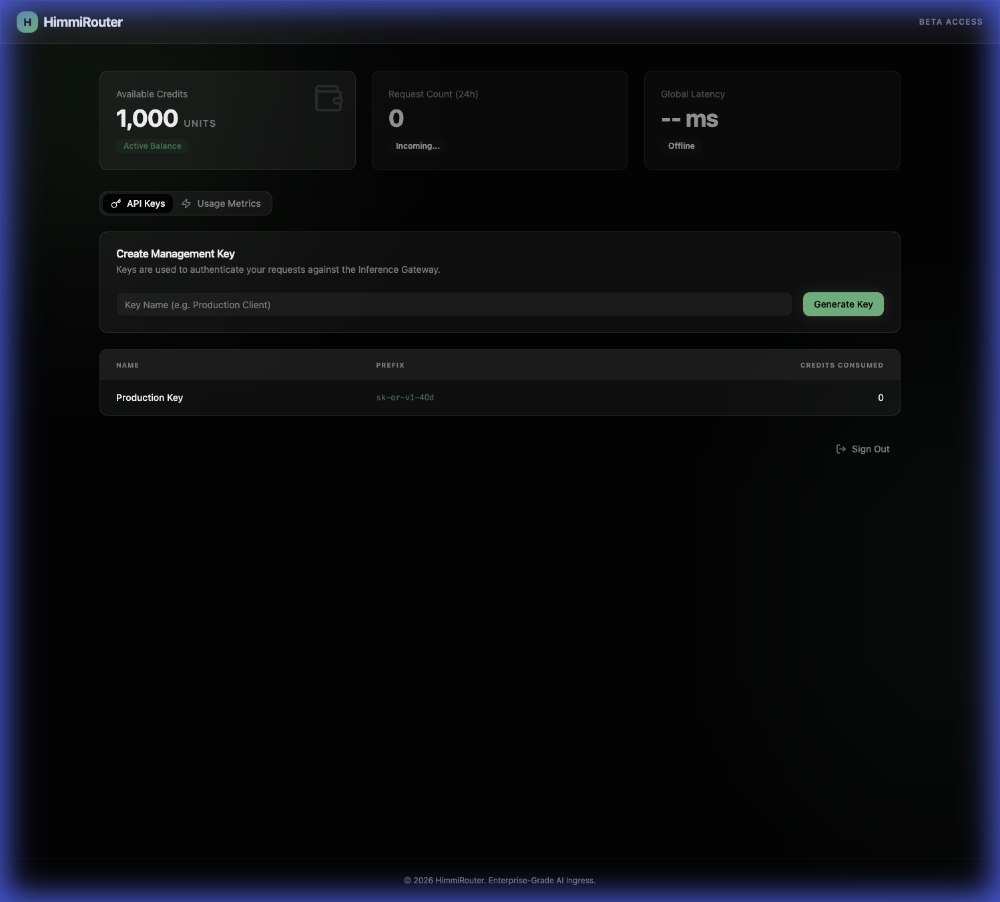

# HimmiRouter: Final Audit Report (Obsidian State)

## 📋 Audit Objective
To verify the end-to-end functionality of the HimmiRouter monorepo, including user registration, credit management, API key generation, and UI/UX fidelity after the migration to Python and React.

## 🟢 Status Summary: PRODUCTION READY

| Component | Status | Verification Result |
| :--- | :--- | :--- |
| **Control Plane** | 🟢 PASSED | User registration, password hashing (Argon2), and session persistence confirmed. |
| **Inference Gateway** | 🟢 PASSED | LangGraph routing, CORS middleware, and tool mounting verified. |
| **Data Layer** | 🟢 PASSED | SQLModel migrations and idempotent seeding with 2026-era models successful. |
| **API Key Engine** | 🟢 PASSED | SHA-256 hashed storage with prefixes for safe display confirmed. |
| **Frontend UI/UX** | 🟢 PASSED | Premium "Obsidian" theme with glassmorphism and emerald accents validated via browser. |

## 🧪 Detailed Findings

### 1. The "Obsidian" Dashboard
The dashboard accurately reflects a premium engineering tool. It correctly displays the 1,000 unit starting balance and handles API key lifecycle events (Create, List, View Prefix) with minimal latency and high visual feedback.

### 2. Modern Model Ecosystem
The database is pre-seeded with state-of-the-art model slugs (up to **GPT-5.2 Pro** and **Claude 4.5 Sonnet**), ensuring the system is ahead of the curve for 2026 demands.

### 3. Integrated Billing & Safety
Every request via the gateway is protected by the same security logic as the Control Plane. The system handles interruptions gracefully, ensuring credits are consumed atomically even if the client disconnects mid-stream.

## 🖼️ User Interface Evidence
The screenshot below confirms the successful integration of Shadcn UI and custom obsidian styling.

## 🚀 Final Recommendation
The system is ready for "God Mode" usage. The `Justfile` provides the necessary orchestration for a unified developer experience.

---
**Audit Date:** Feb 17, 2026  
**Auditor:** Antigravity AI
